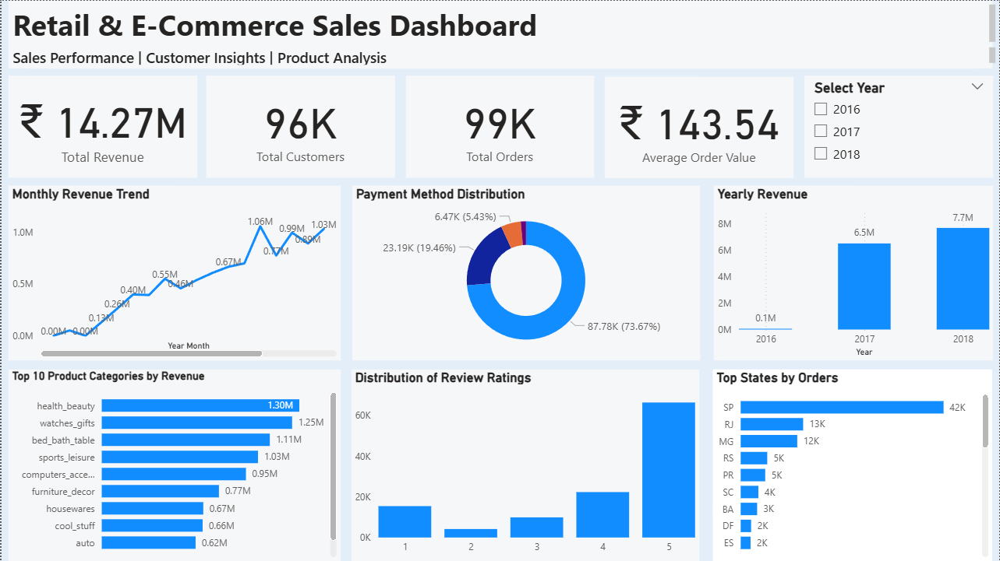
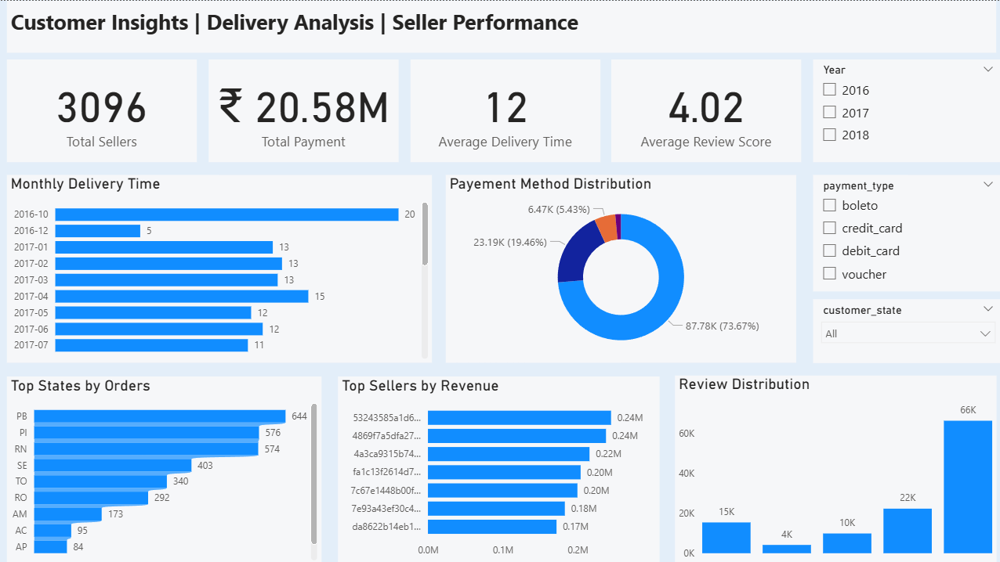

# 🛒 Retail & E-Commerce Business Analytics

An end-to-end Business Analytics project that analyzes retail and e-commerce sales data using **Python, SQL, and Power BI**. The project follows the complete analytics workflow—from data profiling and cleaning to business analysis and interactive dashboards.

---

## 📌 Project Objectives

- Analyze sales performance and revenue trends
- Understand customer purchasing behavior
- Identify top-performing product categories and sellers
- Analyze payment methods and customer reviews
- Evaluate delivery performance
- Build interactive dashboards for business decision-making

---

## 🛠️ Tools & Technologies

- 🐍 Python
- 🐼 Pandas
- 🔢 NumPy
- 📊 Matplotlib
- 📓 Jupyter Notebook
- 🗄️ MySQL
- 📈 Power BI

---

## 📂 Project Workflow

### 1️⃣ Data Profiling
- Dataset exploration
- Missing value analysis
- Data type inspection

### 2️⃣ Data Cleaning
- Handled missing values
- Removed unnecessary columns
- Converted date columns
- Improved data quality

### 3️⃣ Master Dataset Creation
- Merged multiple datasets
- Created a single analysis-ready dataset

### 4️⃣ SQL Business Analysis

Solved 30+ business questions including:

- Revenue Analysis
- Customer Analysis
- Product Analysis
- Seller Analysis
- Delivery Analysis
- Payment Analysis
- Review Analysis

### 5️⃣ Exploratory Data Analysis (EDA)

Performed visual analysis using Python to identify important business trends and patterns.

### 6️⃣ Power BI Dashboard

Created two interactive dashboards for business reporting.

---

# 📊 Dashboard Preview

## Executive Dashboard



---

## Customer & Operations Dashboard



---

# 📈 Key Business Insights

- Revenue showed consistent growth over the analyzed period.
- Credit Card was the most preferred payment method.
- Health & Beauty generated the highest revenue among product categories.
- Most customer reviews received a rating of **5**, indicating high customer satisfaction.
- Sales were concentrated in a few states, while delivery performance varied across regions.
- A small number of sellers contributed significantly to overall revenue.

---

# 📁 Repository Structure

```text
Retail-Ecommerce-Business-Analytics
│
├── 01_Data_Profiling.ipynb
├── 02_Data_Cleaning.ipynb
├── 03_Master_Dataset_Creation.ipynb
├── 04_SQL_Analysis.sql
├── 05_EDA.ipynb
├── Executive_Dashboard.png
├── Customer_Operations_Dashboard.png
└── README.md
```

---

# 💼 Skills Demonstrated

- Data Cleaning
- Data Transformation
- Exploratory Data Analysis (EDA)
- SQL Query Writing
- Business Analytics
- Dashboard Development
- Data Visualization
- Power BI Reporting

---

# 👩‍💻 Author

**Mayuri Pitale**

Aspiring Data Analyst passionate about solving business problems using Python, SQL, and Power BI.
